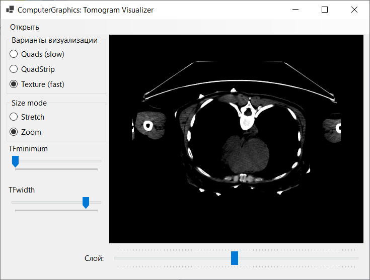

## ComputerGraphics Tomogram Visualizer

Лабораторная работа по курсу компьютерной графики. Визуализация томограммы.

Работу выполнили: [Damlrca](https://github.com/Damlrca), [Mortus19](https://github.com/Mortus19), [aartyomm](https://github.com/aartyomm).

### Особенности работы

- Три варианта визуализации: Quads, QuadStrip, Texture
- Режимы растягивания томограммы: Stretch (Растягивание), Zoom (Масштабирование)
- Выбор диапазона для TransferFunction
